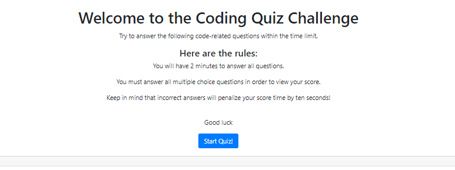
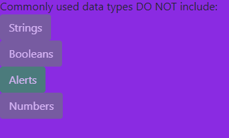
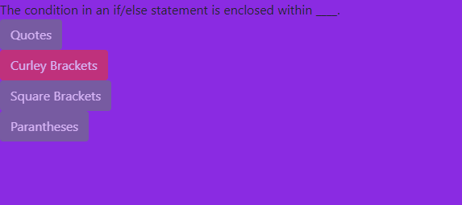

# Code_Quiz

The code quiz is a timed quiz on JavaScript fundamentals that stores high scores. It is created for bootcamps students to gauge their progress compared to their peers. As students we are all anticipating to become web developers, and will most likely be asked to complete a coding assessment. These assessments are typically a combination of multiple-choice questions and interactive challenges. This code quiz will come in handy as we test ourselves over and over again to figure out the correct answers, so that we can continue to gain knowledge on JavaScript fundamentals.

## Process

Building the code quiz was probably the hardest homework assigned so far. I wrote out all of the pseudo coding in complete english sentences so I could break down the steps to create this quiz. I spent several hours trying to figure out how to translate this all into code language and became extremely frustrated when I could not find out how to get the timer to start when the START QUIZ button was clicked. By using a Boostrap component (a card) I created the first page with rules. Please see below for my welcome page: 

If the incorrect answer is selected the answer will turn red. If the correct answer is selected then the answer will turn green.

### Installing/Technology Used

The following platforms were required to build this website:

1) VS code
2) GitBash/Terminal
3) GitLab
4) GitHub

## Built With

* [HTML](https://developer.mozilla.org/en-US/docs/Web/HTML)
* [CSS](https://developer.mozilla.org/en-US/docs/Web/CSS)
* [Javascript](https://developer.mozilla.org/en-US/doc/Web/CSS)

## Deployed Link

* [See Live Site](https://kellykim831.github.io/Code_Quiz/)

## Authors

* **Kelly Kim** 

- [Link to Github](https://github.com/kellykim831)
- [Link to LinkedIn](https://www.linkedin.com/in/realtorkellykim/)
- [Link to Facebook](https://www.facebook.com/kimkelz)

## Acknowledgments

* [Link to Google](https://www.google.com)
* [Link to W3 Schools](https://www.w3schools.com)
* [console.log()](https://developer.mozilla.org/en-US/docs/Web/API/Console/log)
* [DOM Events](https://www.w3schools.com/jsref/dom_obj_event.asp)
* [Element.innerHTML](https://developer.mozilla.org/en-US/docs/Web/API/Element/innerHTML)
* [Document.querySelector()](https://developer.mozilla.org/en-US/docs/Web/API/Document/querySelector)